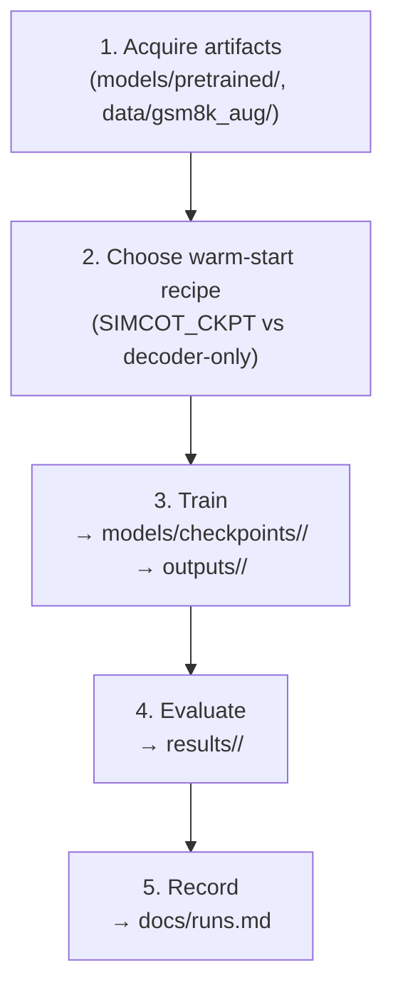

# End-to-End Pipeline

This document walks through the five stages of an experiment run, from acquiring
pretrained artifacts through recording results. Every command is run from the
`pondernet/` directory unless otherwise noted. For flag definitions see
[`parameters.md`](parameters.md); for the run manifest see [`runs.md`](runs.md).

---

## Overview



---

## 1. Acquire artifacts

### Pretrained models — `models/pretrained/` (gitignored)

| Path | Source | Notes |
|------|--------|-------|
| `models/pretrained/gpt2/` | HuggingFace `gpt2` | Plain GPT-2 124M; used as `GPT2_PATH` / `--model_name_or_path` backbone scaffold |
| `models/pretrained/simcot-gpt2-codi/` | `internlm/SIM_COT-GPT2-CODI` | Full CODI wrapper checkpoint (~730 MB); used by `SIMCOT_CKPT` for full-model warm-start |
| `models/pretrained/simcot-gpt2-coconut/` | `internlm/SIM_COT-GPT2-Coconut` | Alternative SIM-CoT variant; not used in current PonderNet runs |
| `models/pretrained/simcot-gpt2-decoder/` | Extracted from `simcot-gpt2-codi` | Standalone GPT-2 decoder for decoder-only warm-start |

The directory is gitignored; team members share these files directly on the
filesystem. The full CODI checkpoint has no fetch script — download
`internlm/SIM_COT-GPT2-CODI` manually if it is missing.

### Fetch the decoder checkpoint

The standalone decoder can be extracted from the CODI checkpoint with the
provided script (run from `pondernet/`):

```bash
python scripts/fetch_simcot_decoder.py --out ../models/pretrained/simcot-gpt2-decoder
```

This downloads `internlm/SIM_COT-GPT2-CODI`, strips the `decoder.*` prefix from
its keys, and saves a clean `GPT2LMHeadModel` to the output path.

### Training data — `data/gsm8k_aug/` (gitignored)

Training data comes from HuggingFace dataset `zen-E/GSM8k-Aug`. The training
script is pinned by default to the local subset:

```
data/gsm8k_aug/train15k.jsonl    # 15,000 examples (default)
```

Override with `DATA_PATH=/path/to/other.jsonl` or `--data_path` on the command
line. When no `--data_path` is given, the script falls back to loading
`zen-E/GSM8k-Aug` from the HF hub. Evaluation always reads the HuggingFace
`gsm8k` dataset (`main` split) — no local copy is needed.

---

## 2. Choose a warm-start recipe

There are two recipes; both are wired into the training script. The choice is
made by setting `SIMCOT_CKPT` before calling the script.

| Recipe | What is warm | How to select |
|--------|-------------|---------------|
| **Full-model** (default) | backbone (`codi.*`) + LoRA adapters + decoder + `prj` | Default: `SIMCOT_CKPT` points to `simcot-gpt2-codi/model-00001-of-00001.safetensors` |
| **Decoder-only** | auxiliary decoder only; backbone is cold (vanilla GPT-2 + fresh LoRA) | Set `SIMCOT_CKPT=""` explicitly |

```bash
# Full-model warm-start (default): all SIM-CoT weights loaded; only halt_head is fresh
bash scripts/train_gpt2_gsm8k_pondernet.sh

# Decoder-only warm-start: cold backbone, warm decoder via DECODER_PATH
SIMCOT_CKPT="" bash scripts/train_gpt2_gsm8k_pondernet.sh
```

In both cases `GPT2_PATH` (equivalently `--model_name_or_path`) **must be a plain
GPT-2 checkpoint**, never the SIM-CoT CODI wrapper. Pointing it at the CODI
checkpoint causes HuggingFace's `AutoModelForCausalLM` to load the wrapper as a
bare `GPT2LMHeadModel`; the namespaced keys (`codi.base_model.model.*`) fail to
match, and the backbone is silently random-initialised. See [`parameters.md`
§ Warm-start recipes](parameters.md#b-warm-start-recipes) for the full trap
description and the sentinel checks that guard against it.

---

## 3. Train

Run from `pondernet/`. Choose a `<run-id>` following the naming convention in
[`runs.md`](runs.md) (pattern: `<base-model>-<method>[-<variant>]-<hparams>`).

```bash
SAVE_DIR=../models/checkpoints/<run-id> \
LOG_DIR=../outputs/<run-id> \
bash scripts/train_gpt2_gsm8k_pondernet.sh
```

The script defaults to 40 epochs, `lr=1e-4`, `--max_latent_steps 6` (K_max),
and the full-model warm-start recipe. Common overrides:

| Override | Example |
|----------|---------|
| Learning rate | `LR=3e-4 bash scripts/train_gpt2_gsm8k_pondernet.sh` |
| K_max | append `--max_latent_steps 8` |
| Epochs | append `--num_train_epochs 20` |
| Fast ablation | append `--max_train_samples 1000` |

Checkpoints are saved per epoch (up to 2 kept) under `SAVE_DIR`. Training logs
and events are written to `LOG_DIR`. The trainer is configured with
`--report_to tensorboard`; the same `LOG_DIR` is the natural run name for a
future MLflow integration (`mlruns/` is gitignored). If the run is interrupted,
re-running the same command auto-resumes from the last checkpoint in `SAVE_DIR`.

---

## 4. Evaluate

### PonderNet (adaptive halting)

Run from `pondernet/`:

```bash
CKPT=../models/checkpoints/<run-id> \
RESULTS_DIR=../results/<run-id> \
THRESHOLD=0.5 \
bash scripts/eval_gpt2_gsm8k_pondernet.sh
```

`THRESHOLD` maps to `--pondernet_inf_threshold`: the model halts when the
cumulative halting probability Σ_k p_k exceeds this value. The default in the
script is `0.5`. To evaluate the same checkpoint at different thresholds, run
the script multiple times pointing `RESULTS_DIR` to sub-directories:

```bash
RESULTS_DIR=../results/<run-id>/thr0.8 THRESHOLD=0.8 bash scripts/eval_gpt2_gsm8k_pondernet.sh
RESULTS_DIR=../results/<run-id>/thr0.9 THRESHOLD=0.9 bash scripts/eval_gpt2_gsm8k_pondernet.sh
```

The script uses `--greedy True` by default, giving deterministic single-pass
evaluation. Outputs written to `RESULTS_DIR`:
- `eval.log` — accuracy and average latent-steps summary
- `gsm8k_pondernet_detail.json` — per-instance step count and correct flag

### Fixed-K baseline

```bash
CKPT=../models/checkpoints/<run-id> \
RESULTS_DIR=../results/<run-id> \
NUM_LATENT=6 \
bash scripts/eval_gpt2_gsm8k_fixedk.sh
```

`NUM_LATENT` sets both `--max_latent_steps` and `--inf_latent_iterations`,
pinning the model to exactly that many latent steps. Also uses `--greedy True`.

### Data source

Both eval scripts read the HuggingFace `gsm8k` dataset (`main` split) — no
local file needed. The training data is not touched during eval.

---

## 5. Record in runs.md

Once eval is complete, add a row to [`docs/runs.md`](runs.md) following the
existing schema:

| Column | Fill in |
|--------|---------|
| `run-id` | The `<run-id>` chosen in Step 3 |
| `date` | Date training finished |
| `method` | e.g. `PonderNet adaptive halting, warm-started` |
| `key hparams` | epochs, lr, `halt_thr`, seed, etc. |
| `GSM8K accuracy` | from `eval.log` |
| `checkpoint?` | `YES — models/checkpoints/<run-id>/` or `no` |
| `notes` | anything notable (known-bad, variant, etc.) |

Also update the **Accuracy Summary** table at the bottom of `runs.md`.

---

## See also

- [`parameters.md`](parameters.md) — complete CLI flag reference, warm-start
  recipes, module/loss glossary
- [`runs.md`](runs.md) — run manifest, naming convention, artifact layout

## Future: MLflow

The trainer already passes `report_to="tensorboard"` in the train script. A
future swap to `report_to="mlflow"` requires no code changes — set the env var
`MLFLOW_TRACKING_URI` and the `<run-id>` string (passed as `--expt_name`) becomes
the natural MLflow run name. The `mlruns/` directory is gitignored.
