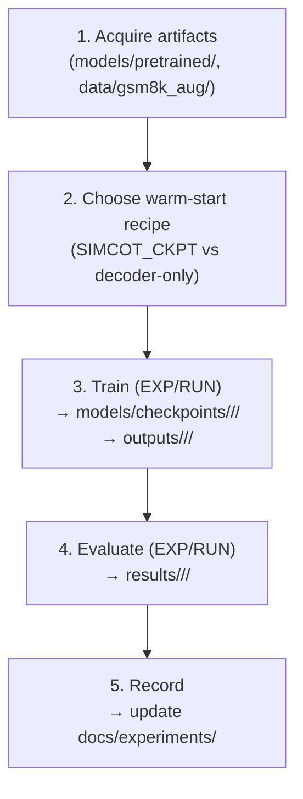

# End-to-End Pipeline

This document walks through the five stages of an experiment run, from acquiring
pretrained artifacts through recording results. Every command is run from the
`pondernet/` directory unless otherwise noted. For flag definitions see
[`parameters.md`](parameters.md); for the experiment index see [`experiments.md`](experiments.md).

---

## Overview



---

## 1. Acquire artifacts

### Pretrained models — `models/pretrained/` (gitignored)

| Path | Source | Notes |
|------|--------|-------|
| `models/pretrained/gpt2/` | HuggingFace `gpt2` | Plain GPT-2 124M; used as `GPT2_PATH` / `--model_name_or_path` backbone scaffold |
| `models/pretrained/simcot-gpt2-codi/` | `internlm/SIM_COT-GPT2-CODI` | Full CODI wrapper checkpoint (~730 MB); used by `SIMCOT_CKPT` for full-model warm-start |
| `models/pretrained/simcot-gpt2-coconut/` | `internlm/SIM_COT-GPT2-Coconut` | Alternative SIM-CoT variant; not used in current PonderNet runs |
| `models/pretrained/simcot-gpt2-decoder/` | Extracted from `simcot-gpt2-codi` | Standalone GPT-2 decoder for decoder-only warm-start |

The directory is gitignored; team members share these files directly on the
filesystem. The full CODI checkpoint has no fetch script — download
`internlm/SIM_COT-GPT2-CODI` manually if it is missing.

### Fetch the decoder checkpoint

The standalone decoder can be extracted from the CODI checkpoint with the
provided script (run from `pondernet/`):

```bash
python scripts/fetch_simcot_decoder.py --out ../models/pretrained/simcot-gpt2-decoder
```

This downloads `internlm/SIM_COT-GPT2-CODI`, strips the `decoder.*` prefix from
its keys, and saves a clean `GPT2LMHeadModel` to the output path.

### Training data — `data/gsm8k_aug/` (gitignored)

Training data comes from HuggingFace dataset `zen-E/GSM8k-Aug`. The training
script is pinned by default to the local subset:

```
data/gsm8k_aug/train100k.jsonl   # 100,000 examples (default; --max_train_samples 100000)
```

Override with `DATA_PATH=/path/to/other.jsonl` or `--data_path` on the command
line. When no `--data_path` is given, the script falls back to loading
`zen-E/GSM8k-Aug` from the HF hub. Evaluation always reads the HuggingFace
`gsm8k` dataset (`main` split) — no local copy is needed.

---

## 2. Choose a warm-start recipe

There are two recipes; both are wired into the training script. The choice is
made by setting `SIMCOT_CKPT` before calling the script.

| Recipe | What is warm | How to select |
|--------|-------------|---------------|
| **Full-model** (default) | backbone (`codi.*`) + LoRA adapters + decoder + `prj` | Default: `SIMCOT_CKPT` points to `simcot-gpt2-codi/model-00001-of-00001.safetensors` |
| **Decoder-only** | auxiliary decoder only; backbone is cold (vanilla GPT-2 + fresh LoRA) | Set `SIMCOT_CKPT=""` explicitly |

```bash
# Full-model warm-start (default): all SIM-CoT weights loaded; only halt_head is fresh
bash scripts/train_gpt2_gsm8k_pondernet.sh

# Decoder-only warm-start: cold backbone, warm decoder via DECODER_PATH
SIMCOT_CKPT="" bash scripts/train_gpt2_gsm8k_pondernet.sh
```

In both cases `GPT2_PATH` (equivalently `--model_name_or_path`) **must be a plain
GPT-2 checkpoint**, never the SIM-CoT CODI wrapper. Pointing it at the CODI
checkpoint causes HuggingFace's `AutoModelForCausalLM` to load the wrapper as a
bare `GPT2LMHeadModel`; the namespaced keys (`codi.base_model.model.*`) fail to
match, and the backbone is silently random-initialised. See [`parameters.md`
§ Warm-start recipes](parameters.md#b-warm-start-recipes) for the full trap
description and the sentinel checks that guard against it.

---

## 3. Train

Run from `pondernet/`. Pick an experiment (`EXP=<NN-exp>`, scaffolded by hand as a new
`docs/experiments/<NN-exp>/` folder) and a `RUN=<run-id>`; the script derives all three
artifact dirs from them. The train/eval scripts refuse to run if `EXP`/`RUN` are unset
or `EXP` doesn't match `^[0-9]{2}-[a-z0-9.-]+$`.

```bash
EXP=04-simcot-pondernet-gammasweep RUN=g0.05-gm3.0-ep5 \
bash scripts/train_gpt2_gsm8k_pondernet.sh
#   → SAVE_DIR=../models/checkpoints/$EXP/$RUN, LOG_DIR=../outputs/$EXP/$RUN
```

Explicit `SAVE_DIR`/`LOG_DIR` still override the derivation (back-compat).
The script defaults to 5 epochs, `lr=2e-5`, `train100k.jsonl` (`--max_train_samples
100000`), `--max_latent_steps 6` (K_max), and the full-model warm-start recipe.
Common overrides:

| Override | Example |
|----------|---------|
| Learning rate | `LR=3e-4 bash scripts/train_gpt2_gsm8k_pondernet.sh` |
| K_max | append `--max_latent_steps 8` |
| Epochs | append `--num_train_epochs 20` |
| Fast ablation | append `--max_train_samples 1000` |

Checkpoints are saved per epoch (up to 2 kept) under `SAVE_DIR`. Everything for a
run lands in its `LOG_DIR` folder — no need to redirect stdout yourself:

| File in `LOG_DIR` | What it is |
|-------------------|------------|
| `command.sh` | The exact resolved invocation (every flag, incl. `--learning_rate`) plus the key env overrides, git SHA, host, and timestamp. Copy-paste re-runnable; the record of what produced the run. |
| `train.log` | Full stdout+stderr of the run (the script tees into it). |
| `events.out.tfevents.*` | TensorBoard scalars (`--report_to tensorboard`). |

The same `LOG_DIR` is the natural run name for a future MLflow integration
(`mlruns/` is gitignored). If the run is interrupted, re-running the same command
auto-resumes from the last checkpoint in `SAVE_DIR`.

---

## 4. Evaluate

### PonderNet (adaptive halting)

Run from `pondernet/`:

Run eval at `--batch_size 1` for faithful halting, on the **idle 3060**
(`CUDA_DEVICE_ORDER=PCI_BUS_ID CUDA_VISIBLE_DEVICES=0`):

```bash
EXP=04-simcot-pondernet-gammasweep RUN=g0.05-gm3.0-ep5 \
CKPT=../models/checkpoints/04-simcot-pondernet-gammasweep/g0.05-gm3.0-ep5 \
THRESHOLD=0.5 \
CUDA_DEVICE_ORDER=PCI_BUS_ID CUDA_VISIBLE_DEVICES=0 \
bash scripts/eval_gpt2_gsm8k_pondernet.sh
#   → RESULTS_DIR=../results/$EXP/$RUN
```

`THRESHOLD` maps to `--pondernet_inf_threshold`: the model halts when the
cumulative halting probability Σ_k p_k exceeds this value. The default in the
script is `0.5`. To evaluate the same checkpoint at different thresholds, point
`RESULTS_DIR` at sub-directories (an explicit `RESULTS_DIR` overrides the `EXP`/`RUN`
derivation):

```bash
RESULTS_DIR=../results/$EXP/$RUN/thr0.8 THRESHOLD=0.8 bash scripts/eval_gpt2_gsm8k_pondernet.sh
RESULTS_DIR=../results/$EXP/$RUN/thr0.9 THRESHOLD=0.9 bash scripts/eval_gpt2_gsm8k_pondernet.sh
```

The script uses `--greedy True` by default, giving deterministic single-pass
evaluation. The eval script **self-logs** into `RESULTS_DIR` — no manual `tee`:
- `command.sh` — the exact resolved eval invocation (git SHA, host, threshold)
- `eval.log` — full stdout+stderr (accuracy + avg latent-steps)
- `summary.json` — machine-readable metrics (`accuracy_pct`, `avg_steps_used`,
  `threshold`, `ckpt`, …); read when recording the run
- `gsm8k.json` — predictions for every test instance
- `gsm8k_pondernet_detail.json` — per-instance step count and correct flag

### Fixed-K baseline

```bash
CKPT=../models/checkpoints/<run-id> \
RESULTS_DIR=../results/<run-id> \
NUM_LATENT=6 \
bash scripts/eval_gpt2_gsm8k_fixedk.sh
```

`NUM_LATENT` sets both `--max_latent_steps` and `--inf_latent_iterations`,
pinning the model to exactly that many latent steps. Also uses `--greedy True`.

### Data source

Both eval scripts read the HuggingFace `gsm8k` dataset (`main` split) — no
local file needed. The training data is not touched during eval.

---

## 5. Record the run

Once eval is complete, record the run using its mechanical artifacts
(`outputs/<NN-exp>/<run-id>/command.sh` and `results/<NN-exp>/<run-id>/summary.json`):

- write the per-run detail page `docs/experiments/<NN-exp>/<run-id>.md`
  (hyperparameters from `command.sh`, results from `summary.json`),
- add/update that run's row in `docs/experiments/<NN-exp>/runs.md`,
- refresh the headline in [`docs/experiments.md`](experiments.md) if it's a new best.

You author the narrative/notes; the numbers and links come from those two files. Before
the first run of a new investigation, create the experiment folder under
`docs/experiments/<NN-exp>/` by hand, following an existing one as a template.

---

## See also

- [`parameters.md`](parameters.md) — complete CLI flag reference, warm-start
  recipes, module/loss glossary
- [`experiments.md`](experiments.md) — experiment index, per-experiment narrative,
  per-run detail, artifact layout

## Future: MLflow

The trainer is a HuggingFace `transformers.Trainer`, so MLflow can be enabled
later via `report_to="mlflow"`. The run-id convention maps naturally onto an
MLflow run name/tags (HF Trainer exposes a `--run_name` flag for this).
`mlruns/` is already gitignored.
